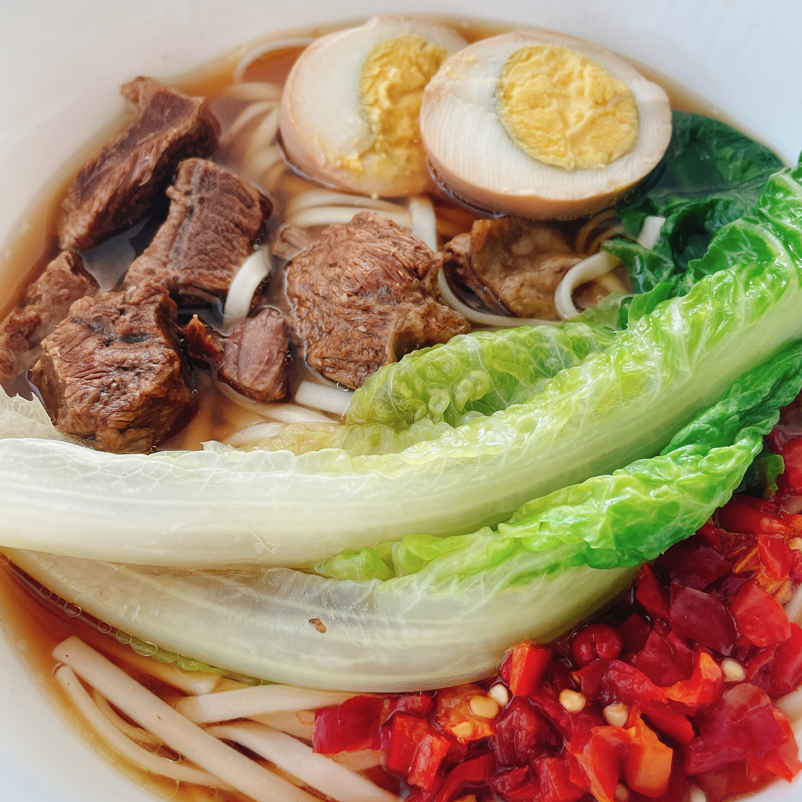
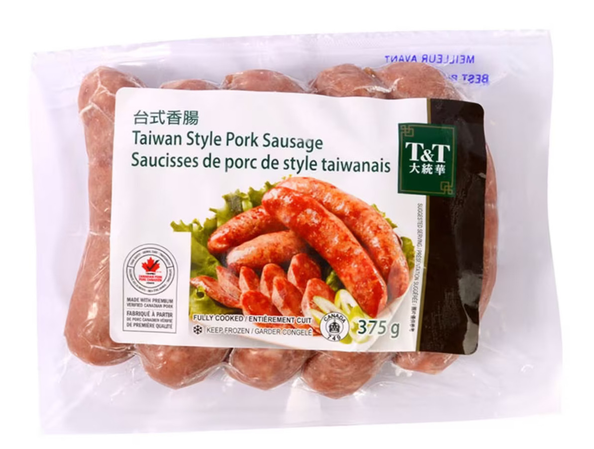
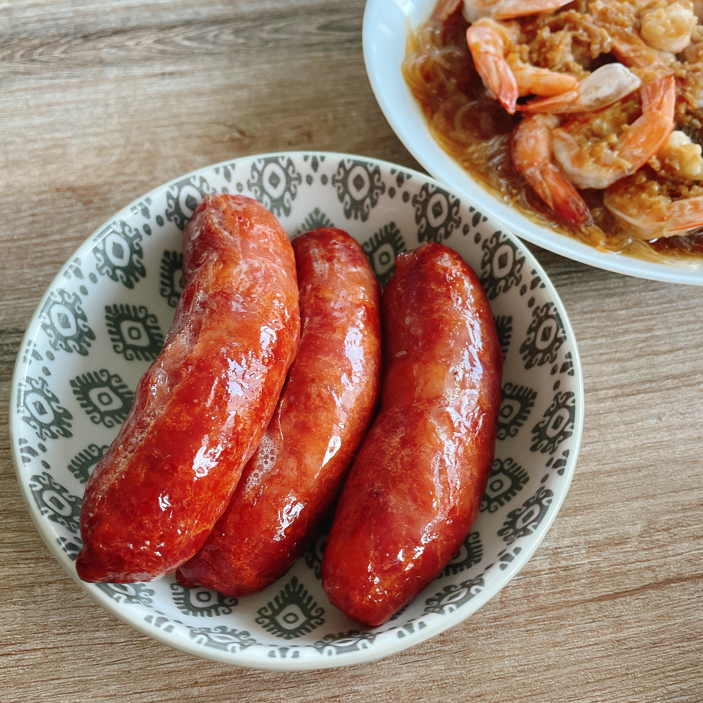

## 开始的最好时间是现在

中文博客开张才一周，起初还在纠结：到底是写每月小结还是每周小结？还是不写总结，想到什么写什么？

后来索性懒得想了，这样下去只会陷入无尽的计划陷阱之中 (get organized trap，我自创的)。

前几个月在学习使用Obsidian的时候[从一个YouTube](https://youtu.be/zIh1S7ra3aI)视频里学到了一个词，叫做avoid front loading。大意是不要总想着一开始就想着把所有的东西弄得井井有条，比如文件层级怎么分类、标签要怎么命名等等。因为系统总会随着想法改变而更新，如果老是强迫症一样想把所有东西都统一到这个系统里，会把很多时间浪费在无尽的“变得更有条理"上，但这件事本身并不会带来太多收益。

所以虽然这篇叫月度总结，很多都是最近的事情～

## 一些小确幸

**最近猫咪养成了睡觉前要来床上撸一撸的习惯**。虽然呼噜声像小马达一样响、还在身上到处乱踩，我倒没有感觉很困扰。不如说晚睡十分钟换得回血一百分，猫和人都开心，双赢～

**终于入了新出的游戏《Hogwarts: Legacy》**。才开始玩没多久，但作为熟读原著N遍的书粉已经从人名里找到了好多个彩蛋。近年来我对所谓的开放世界越来越不买帐，觉得RPG游戏能把剧情和故事讲好就已经很出众了。动不动就100+小时的游戏时长我也承受不了，很容易变成坑，现在觉得RPG游戏40～60小时左右的时长比较理想。从短短的几个小时来看，霍格沃茨游戏做得还是很让人沉浸的，这点十分难得。

**用Hugo搞了这个中文博客，还顺便把自己的另一个博客也迁移了**。虽然两个博客的目的完全不同，但核心都是通过写作来探索自我。写作这个事情，就是不写也不会意识到什么，一旦开始就好像有点停不下来。虽然我的中英文写作风格完全不同，但无论哪种语言，在写的过程中似乎都会刺激大脑表达的那一部分。就像我在思考写每月总结的时候，也会同时源源不断激发出英文写作的灵感。

**下单了新的机械键盘**。这套客制化机械键盘在我购物车里躺了好久了，趁打折把键帽、轴体和壳子一口气全部下单，好爽。买这套是想替换手里的Keychron K4。K4是我的第一个机械键盘，当时选了据说万金油的茶轴，到手后感觉无功无过，说不上讨厌，但也没那么喜欢。等自己配了一套机械键盘后，逐渐发现我喜欢触发压力轻的轴体，所以这次挑了个线性轴（Tiffany轴）和蓝黄色的键帽颜色搭配。期待收货～

**连续用ATracker记录时间块达到一个月**。除了睡觉的任何时间都在用这个app记录，我把生活中的事情分成了图中的五个大类，在每一类下面才是我记录的小项。比如Downtime里面包括Survival（生存必须的吃喝拉撒）以及Home（打扫、去超市等家务）。记录时间的目的是1）看看时间都去哪儿了；2）在此基础上有没有可以提升的空间。我觉得这个app非常好用，是少有的直接击中痛点的app，也许过一阵专门写个总结吧。

## 最近的买买买

### 什么值得买

#### 牛腩替代Boneless Cross Rib Pot Roast

做中式牛腩的绝佳替代品！我一直分不清各种牛肉部位，查了牛腩对应的英文是brisket，但本地超市都找不到，据说是因为中西式切割方法不同。后来看到北美博主的菜谱用了short ribs，最近终于有机会尝试一下，结果十分成功，软儒Q弹堪比专业餐馆的程度。

之前要买牛腩只能去中超买，选择十分有限。我还尝试过那种切好的stew beef，肉质非常柴，一点都不适合长时间慢炖。Short ribs的脂肪都很均匀，怎么炖都好吃。我挑的这块牛肉如名字所示，是不带骨的，我看到博主用过带骨的小块short ribs，看上去也很香～ 另外还有一种韩式烧烤的那种片状牛肉，虽然也叫short ribs但肉太薄了，感觉只适合烧烤不适合慢炖。

这是用牛肉和炖的牛肉汤做的卤蛋牛肉面：

#### Chick-fil-A的饮料Frosted Lemonade

Chick-fil-A在我这开了好几年了，这个月第一次去。不知道点什么，就试了网上推荐的套餐。豪华香辣汉堡的肉很入味、多汁，但饮料Frosted Lemonade给我印象更深。似乎是由柠檬水和香草冰淇淋一起打成的奶昔，味道很像是三得利乳酸菌的冰沙版本。推荐！

#### 大统华的台湾香肠

这个完全就是小时候街边报刊亭2块钱一根的烤肠味道。刷一层油，进空气炸锅中低温烤熟，简直不要太香了！需要注意的时温度不能太高，我第一次烤的时候和平时烤肉一样用的350度，结果左一的烤肠肠衣就爆了。

要说缺点的话就是有点咸，不太适合干吃（也可能我年纪大了口淡😄）。以及价格不太美好，5个烤肠要8刀，以淀粉肠来说属实有点儿贵了吧。

  

#### 宜家鲨鲨

几个月前买了鲸鱼，最近终于也入手了人见人爱的鲨鲨！在长毛象上我也发过鲸鱼🐳和鲨鱼🦈的对比：

<iframe src="https://m.cmx.im/@kyo/110033403381657498/embed" class="mastodon-embed" style="max-width: 100%; border: 0" width="400" allowfullscreen="allowfullscreen"></iframe>

买了之后终于知道为什么看似普通的玩偶这么流行。因为真的很疗愈耶！我会把这项购物归类为“心理健康”旗下而不是“玩具”。

### 什么不值得买

#### 大统华的芋泥盒子

我是真心想给大统华甜品一个机会，但它还是让我失望了(Ｔ▽Ｔ)。能吃，但是奶油口感不好。我不知道是不是混了植物奶油进去，但和自己做的打发淡奶油完全不是一个味道。以后应该不会再尝试大统华任何带奶油的甜品了。

#### 大统华的抹茶慕斯白玉卷

抹茶慕斯馅味道挺好的，但是外面包裹的那层卷毫无味道，和橡胶一样味同嚼蜡。在意的话慎入。

## 织毛线 Knitting

月初开坑要给猫咪织个新的小毛毯。我不喜欢重复性太高的图样，就选了个复杂一点的。织出来的效果很好看，就是实在太！慢！了！这个图样相当于织了两行才显示出一行的效果，换句话说就是效果延迟到普通的50%。我倒也不急着织完，但图案复杂到无法一边听podcast一边织，就有点崩溃。

颜色方面也踩了坑。我用的毛线是自带换色的（self-striping），但是我对效果不太满意。最终还是手动把毛线分出几大卷不同的颜色。以后切记谨慎购买自换色毛线，因为你永远不知道它会不会在完成一个图案的中途变色……

## 听了什么 Podcast

除了一些零碎的新闻类podcast，主要听了两个案子：

### Uncover S3: The Village

Uncover这个系列不太偏向调查，更注重故事本身，以及与过去、现在的联系，所以经常能了解到很多背景故事。

第三季讲的是一个针对Gay群体的连环谋杀案，里面提到了非常多针对LGBTQ的歧视。以现在的眼光来看还挺让人大跌眼镜的，毕竟近十几年多伦多一直是LGBTQ先锋的城市形象，很难想象在60～90年代竟然如此保守落后。警察系统内的歧视就不提了，连普通人在大街上接受采访都明目张胆地说”觉得Gay就是有问题、就应该被监视“。

案件本身（时间线、手法等等）没有讲得特别详细。想要了解多伦多LGBTQ历史的可以听一下。

### Your Own Backyard

发生在美国加州一所大学的女生失踪案。

超级精彩的案件！不能讲太细，一讲就会剧透。调查的节奏把握得非常好，有一直吸引人听下去的冲动。主持人主业其实是音乐人，做的背景音乐相当不错，悬疑风格很强。

如果要推荐罪案类podcast的话，这个案子绝对能进前三。

## 继续加油

**依旧捉急的拿铁拉花(Ｔ▽Ｔ)**。同样是乞丐版设备（宜家的10刀法压壶），为什么YouTube博主就能那么流畅！也终于明白了为什么会存在Barista competition这个东西。这门技术会衍生出一项比赛，是有一定道理的。

**虽然还没卖出去，但总算把旧电脑备份、清空了**。许久没有重装系统，我仿佛变成了电脑白痴，连开机按哪个键进入哪个恢复程序都忘了，为此浪费了好多时间。果然一件事很久不做就会忘得干干净净啊。

> Photo by <a href="https://unsplash.com/@glencarrie?utm_source=unsplash&utm_medium=referral&utm_content=creditCopyText">Glen Carrie </a> on <a href="https://unsplash.com/photos/5eyAJMTb6mM?utm_source=unsplash&utm_medium=referral&utm_content=creditCopyText">Unsplash </a>
