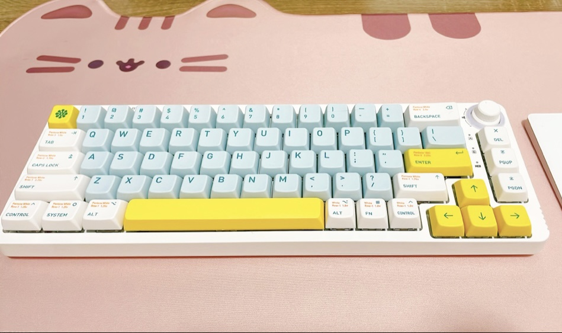

多伦多的四月仿佛是夏天和冬天的决战，互相在追逐抢夺最后的位置。明明前一周温度升到了历史最高温，下一周就迎来了春雪。公寓管理处也开与不开空调之间摇摆，留我在30度的室内温度下挣扎。

## 本月小确幸

**[上个月提到的机械键盘]()到啦**。这套的轴体是Durock L2线性轴，手感意外地很不错，也相对静音。机械键盘，尤其轴体，果然还是要上手试过才知道自己喜欢什么。这套置换的是一个用Gateron茶轴的键盘（Keychron K4），虽然茶轴号称万金油，但我越用越不喜欢它的手感。结合试用过的其他几款，最后总结出我喜欢压感轻的线性轴打字。但所有的评测文章都会告诉你Clicky轴最适合码字，线性轴易误触、更适合玩游戏。**然而我的实际体验完全不同**。由于我打字力度很轻，用Clicky轴会非常累，反倒是线性轴，几乎从未误触。

**买到了乔治·马丁的Dreamsongs: Volume I**。偶然经过二手书店就进去逛了逛，意外发现了马丁这本短篇小说集。实体书店总是能给人惊喜，其实就算不买，随便翻翻书也很开心！

**终于报完税了！** 今年依旧是用Wealthsimple完成了报税。虽然我没做多少事（家属做了绝大部分），但报税本身就是相当累。想到还要交钱也很累，不过我对税收的心态比较平和。高税收是社会正常运转需要付出的代价，若没有这部分代价，那它的结果也会以各种各样的形式反映到生活里面。

## 玩了什么

### Hogwarts: Legacy

这部作品是给书粉的礼物。开场的夜骐马车就惊为天人，不是骨灰级哈迷写不出这种细节。城堡设计极其出色，从画像的还原程度，我几乎可以肯定制作组把原书所有跟城堡有关的描写都搬到游戏场景里面了。

差不多花了60小时通关。主线表现平平，倒是支线同伴Sebastian的任务线，光芒完全盖过了主剧情。出现了一些争议，但人物塑造依旧十分出彩，我和姬友甚至久违地磕起了CP。

翻一翻Tumblr，AI时代的同人已经完全不似往日，不但有AI生成语音，还有人用语料做出了聊天机器人。作为当代同人女实在是太幸福了。

### Overcooked 2

很久以前通关了一代，直到上个月才想起来没玩过2代，刚好本月打折到15刀，迅速入手。

虽然号称是《分手厨房》，但我和家属在游戏里合作不错，不会推锅，做砸了也都是以爆笑收场。

> 啊啊啊上错菜了！客人点了一个肉酱意面🍝一个蘑菇意面🍜，结果我上了一盘蘑菇炒肉🥗！  
> (Ｔ▽Ｔ)

于是花了两晚三星通关了本篇，我和家属正在“不愧是我、超有默契、天作之合”的互吹中得意忘形，没想到结局后还有隐藏四星，而四星的分数是三星的几倍。还有几个DLC，加入了新的菜谱，难度也比本篇更高。这下又能好好玩一阵了。

## 看了什么

### The Lord of the Rings: The Rings of Power

看完后终于知道了为什么风评很低。我期望也不高，毕竟没有《精灵宝钻》的版权，电视剧只是采用了一些原世界观设定。但即使当成《魔戒》的同人作品来看，也很难算是一部好的作品。凑数的地方太多，有些情节大概三流编剧都不会这么写。

### House of Dragon

除了不下饭，其他都很好。基本忠于原著《血与火》，毕竟马丁也参与了制作。《血与火》我一直没看，可能跟《公主与王后》、
《游侠王子》内容重复太多，所以吸引力对我不够高。但血龙狂舞这段历史还是很有意思的，黑绿两党冲突激烈，也很血腥，想来确实很适合拍成HBO电视剧。在已经知道最终结局的前提下也依旧期待电视剧的视觉展现。看完电视剧，好像又有读原著的热情了。

至于未完结的《冰与火之歌》，对它抱有很复杂的情绪。既怀有希望，又告诉自己不要心存幻想。看到卷五还在不停铺陈发散的时候，我就隐隐感觉这书估计是写不完了。但即使没有完结，也不妨碍它在我心中的地位。场景描写像诗一样，语言简练优美，好多时候都能读到潸然泪下。

### The Lord of the Rings: The Return of the King 二十周年重映

虽然每几年都要来一次《魔戒》+《霍比特人》电影马拉松，但实际上我从未在影院看过《魔戒》三部曲。今年是第三部的20周年，北美的影院上映了4小时的加长版。除了最喜欢的"I am no man"，第二个印象很深的场景就是Rohirrim骑兵冲刺了。大屏幕加上环绕音响，我第一次感受到了骑兵的震慑力，也瞬间明白了为何《文明》里面骑兵对步兵是全方位压制。不出意料地我又激动到几度洒泪。

## 什么值得买

### 小甜酒

虽然之前说不喝酒了，但还是禁不住象友安利，买了著名的百利甜和Malibu Coconut Rum Liqueur。四个字：相见恨晚。

百利甜和咖啡绝配，尤其[冰拿铁](https://www.baileys.com/en-ca/recipes/baileys-latte)，又香又浓郁。唯一需要担心的是早上不小心放太多会不会影响工作。

Malibu Coconut Rum Liqueur加菠萝汁就是简单版piña colada，夏天来一杯太爽了。难怪LCBO网站上有近四千多评分，大家还是很有眼光的。

> 一个新发现的冰咖喝法：事先把咖啡冻成冰块，第二天加入冰牛奶。这样的冰咖啡会越喝到后面越香浓喔～

## 织毛线 Knitting

织了一件夏天穿的小背心！图样挺简单的，织得很快，差不多四五天就织完了。线是100%亚麻，所以穿起来也足够凉爽。线有一点儿粗糙，织太久会磨手，但亚麻的特点是越洗越软，期待一个夏天之后的效果。

天气渐渐热了，可以暂时把冬天没织完的厚重毛线休眠，是时候物色（买买买）一些夏季的新毛线了。

## 新的尝试

### Fitness Boxing 2 有氧拳击

尝试了试玩版本后，在二手市场以半价买入了卡带。打拳很能解压，我久违地体会到了运动的快乐。听说拳击的健身效果也很好，希望多多坚持打拳。

> Photo by <a href="https://unsplash.com/@evgenylazarenko?utm_source=unsplash&utm_medium=referral&utm_content=creditCopyText">Evgeny Lazarenko</a> on <a href="https://unsplash.com/photos/8HknSpvc1CU?utm_source=unsplash&utm_medium=referral&utm_content=creditCopyText">Unsplash</a>