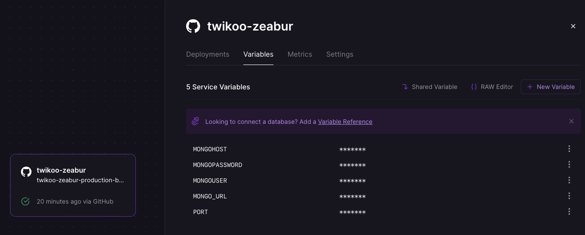
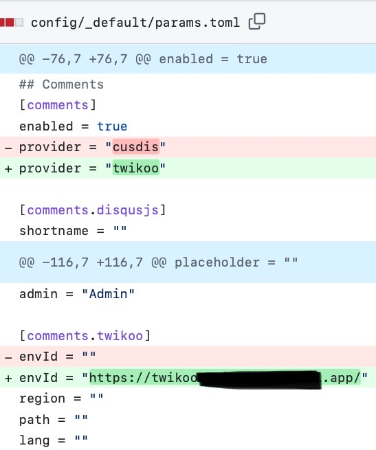
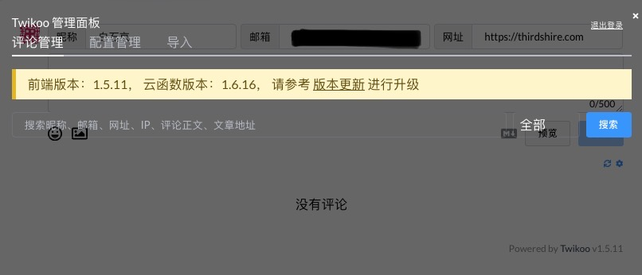
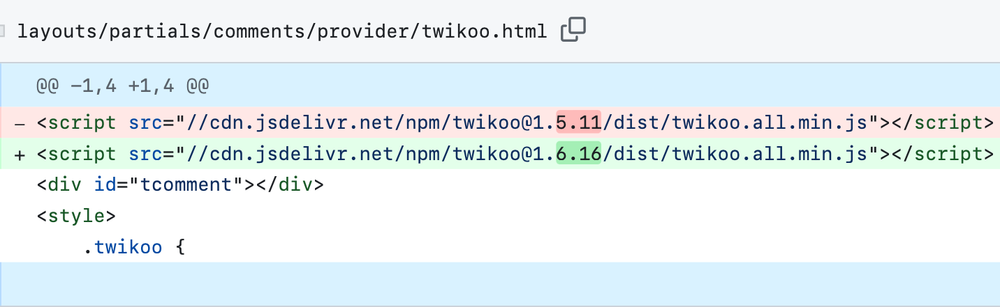
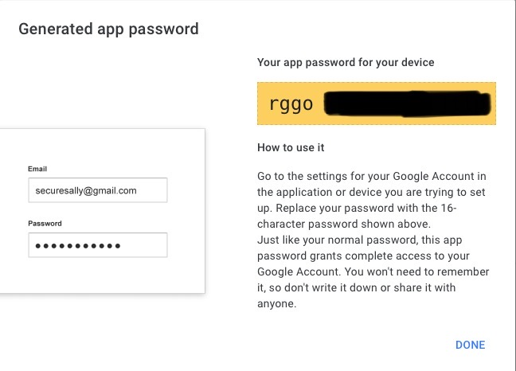

> 本文指的博客为静态博客，例如Hugo，Hexo，Jekyll这样完全由用户掌控内容的静态博客生成器

## 为什么选择Twikoo

-   开源，免费，轻量无广告（吊打Disqus等一众评论服务）
-   匿名性好，不需要强制社交账号登录（重要‼️）
-   有新评论时可收到邮箱/即时消息通知
-   游客若留下邮箱，评论被回复时可收到邮件提醒（cusdis不支持）
-   数据支持导入导出

总之其他评论系统有的它都有，且更加灵活。

[Twikoo官网](https://twikoo.js.org)

## 大致流程

> 不想知其所以然的话，可以跳过这一段

以下是我作为一个非程序员的浅显理解：

配置分三部分：数据库（后端），deploy平台（后端），博客网页（客户端/前端）。 这类web app的配置思路大致是：数据库负责储存数据，deploy平台来执行代码、将其变为app，最后连接到博客，从而在网页显示出来。所以必须按顺序操作，每一步都需要前一步得到的信息从而连接到一起。

## 1. 设置数据库MongoDB

数据库的设置比较难找，具体请参考B站这个[【Twikoo Vercel 部署教程】](https://www.bilibili.com/video/BV1Fh411e7ZH/)的第一部分"部署数据库"进行设置。设置的时候，把里面提到的用户名、密码以及长长的那串链接记录下来待用。

## 2. Deploy平台：Vercel/Railway部署

除了手动档外，Twikoo文档里提供了以下几个服务选择。

> 以下来自Twikoo官网文档： Vercel 部署 \[ 建议 \] 适用于想要免费部署的用户，在中国大陆访问速度较慢甚至无法访问。 Railway 部署 \[ 建议 \] 有充足的免费额度，部署简单，适合全球访问。 Zeabur 部署 \[ 建议 \] 有充足的免费额度，部署简单，适合中国大陆访问。

Vercel完全免费，但目前在大陆境内已经被封，意味着非翻墙用户无法评论。Railway每个月有\$5的免费额度，用来托管评论服务够用了。需要注意的是免费tier有每月500小时的运行限制，每个月有几天评论服务会被暂停，需要下月登录Railway重新激活。嫌麻烦的话建议绑定信用卡来激活开发者tier，这样在\$5的额度内依旧免费，但是运行时间无限制。

以下将以Railway为例。如果选择Vercel，按照上面的视频教程继续操作就行，可以跳到[第三步](#3-设置博客)。

1.  在[Railway](https://railway.app/dashboard)申请账号，登录后点New Project - Provision MongoDB。这时页面里会出现一张名为MongoDB的卡片
2.  去Twikoo的这个repo [imaegoo/twikoo-zeabur](https://github.com/imaegoo/twikoo-zeabur)，fork到自己的账号下
3.  回到Railway刚才的页面，右上角New - GitHub Repo - Configure GitHub App - 登录并授权 GitHub - 选择上一步fork的repo。成功后页面里会有第二张卡片twikoo-zeabur
4.  点击twikoo-zeabur卡片，在右边栏里选择Variables - New Variable，添加以下变量：

`PORT`: 8080 `MONGO_URL`: MongoDB得到的长链接 `MONGOUSER`: MongoDB用户名 `MONGOPASSWORD`: MongoDB密码 `MONGOHOST`: 长链接"\@"之后的部分，以.net结尾，如`cluster0.xxx.mongodb.net`



其中MongoDB的长链接里包含了`MONGOUSER`、`MONGOPASSWORD`和`MONGOHOST`，格式如下。`<my_name>`即为用户名，`<my_password>`为密码，"\@"之后的网址为`MONGOHOST`地址。

```         
mongodb+srv://<my_name>:<my_password>@cluster0.xxx.mongodb.net/xxx
```

5.  在右边栏里点Settings - Environment - Domains选项下选择Generate a Domain，会生成一个格式为`xxx.up.railway.app`的URL，记下备用

## 3. 设置博客

### 查看主题是否支持Twikoo

[Twikoo文档里附有支持Twikoo的主题列表](https://twikoo.js.org/quick-start.html#在-hexo-中使用)，大部分是Hexo主题。

-   如果支持：那这一步就很简单，通常在设置文件内加入Railway链接即可。具体步骤可参考上面主题列表里的文档链接。以我的Hugo-Stack主题为例，在主题配置文件里修改评论服务为twikoo，然后把第二步最后的链接加上https前缀添加在`envID`里，如`envID = "https://xxx.up.railway.app"`



-   如果主题不支持：也没有关系，需要在博客文件夹内搜索footer.html（一般主题都有这个文件）并手动加入以下代码，并将里面的`您的环境id`改为和上文一样的Railway链接，如`envId: 'https://xxx.up.railway.app'`

``` html
<div id="tcomment"></div>
<script src="https://cdn.staticfile.org/twikoo/1.6.16/twikoo.all.min.js"></script>
<script>
twikoo.init({
  envId: '您的环境id', // 腾讯云环境填 envId；Vercel 环境填地址（https://xxx.vercel.app）
  el: '#tcomment', // 容器元素
  // region: 'ap-guangzhou', // 环境地域，默认为 ap-shanghai，腾讯云环境填 ap-shanghai 或 ap-guangzhou；Vercel 环境不填
  // path: location.pathname, // 用于区分不同文章的自定义 js 路径，如果您的文章路径不是 location.pathname，需传此参数
  // lang: 'zh-CN', // 用于手动设定评论区语言，支持的语言列表 https://github.com/imaegoo/twikoo/blob/main/src/client/utils/i18n/index.js
})
</script>
```

这样博客设置就完成了。

### 可能会遇到的问题

-   如果手动粘贴代码到html，可能效果不一定尽如人意（位置太高等等）。这是因为主题没有自带针对Twikoo的美化设置，需要自己鼓捣一下主题内的html/css
-   如果点击评论右下小齿轮时显示前端版本落后,如下图:



可能是由于主题内置的Twikoo版本没有更新，可在博客文件夹内全文搜索"twikoo"（请善用VS Code的全局搜索）并找到这一行代码：

``` html
<script src="//cdn.jsdelivr.net/npm/twikoo@1.5.11/dist/twikoo.all.min.js"></script>
```

将里面的`twikoo@1.x.xx`替换成上文提示内的最新版本号`twikoo@1.6.16`即可，如下图：



## 4. Twikoo管理设置

现在博客里应该能看到Twikoo界面了。点击右下角的蓝色小齿轮进入管理员界面，第一次需要设置管理密码，进入后可在"配置管理"里更改选项。

> **一定要把这个密码记好**‼️ 不然忘记密码会非常麻烦，需要从第一步从头开始（别问我是怎么知道的(Ｔ▽Ｔ)。）

除了通常的博客名称、站点URL之外，以下几个隐私安全选项建议注意一下：

**通用** `REQUIRED_FIELDS`: 默认昵称和邮箱为必填项。我修改成了`nick`，也即邮箱变为选填，游客能够完全匿名（当然不留邮箱就收不到回复提醒了）

**隐私** `SHOW UA`: 默认会显示用户系统和浏览器，处于隐私因素我修改成了`false`

**反垃圾** `AKISMET_KEY`：垃圾过滤器，可以帮忙过滤spam。设置也很简单，只需去[Akismet官网](http://akismet.com/)弄一个API key就可以了，选择Personal并把价格调到\$0，下单之后把得到的Akismet API key填在这里

### （可选）配置Telegram机器人提醒

通过设置Telegram机器人提醒，站长能够在新评论时得到Telegram消息提示。创建telegram机器人的教程网上挺多的（比如z-lib telegram bot），以下是精简无图版本：

1.  **获取API Token** 在Telegram[\@BotFather](https://t.me/BotFather)的聊天界面输入 `/newbot` - 创建机器人名称 - 创建机器人用户名 - 得到一长串的**API token**
2.  **获取chat id** 在[\@userinfobot](https://t.me/userinfobot)内输入`/start`- 获得的id即为自己的**chat_id**。把从两个bot得到的东西拼到一起，中间用 "\#" 号分隔，即api_token#chat_id。示例：`5262***170:AAEzkaMjOayU13fFzcg9PI7_7*****p1iAs#11111111`
3.  **设置Twikoo** 在Twikoo设置的"即时消息"选项下填入以下信息： `PUSHOO_CHANNEL`: telegram `PUSHOO_TOKEN`: api_token#chat_id

### （可选）配置邮件通知提醒（Gmail邮箱示例）

配置邮箱通知提醒后，每当游客被博主或其他人回复时，他们就会收到邮箱提示。

在Twikoo设置的"邮件通知"选项下填入邮箱信息。以Gmail邮箱为例，以下为必填项：

`SENDER_EMAIL`: Gmail邮箱地址 `SMTP_SERVICE`: Gmail `SMTP_USER`: Gmail邮箱地址 `SMTP_PASS`: Gmail应用专用密码

注意`SMTP_PASS`这里不是填写自己的邮箱密码，而是**应用专用密码(App password)**。Google现在做了调整，必须要先开启邮箱的手机两步验证才能使用App password。入口比较隐蔽，我建议开启两步验证之后直接在设置里搜索关键词App password或应用密码。具体教程可参考[官方问答](https://support.google.com/mail/answer/185833?hl=zh-Hans)。

进入App password界面后，点Select app - Other，取个名字后就能得到16位的应用专用密码了。



Twikoo的邮箱设置保存后，可以点击设置最下方的"邮件通知测试"并输入测试邮箱的地址，能收到邮件的话，那就算成功啦。