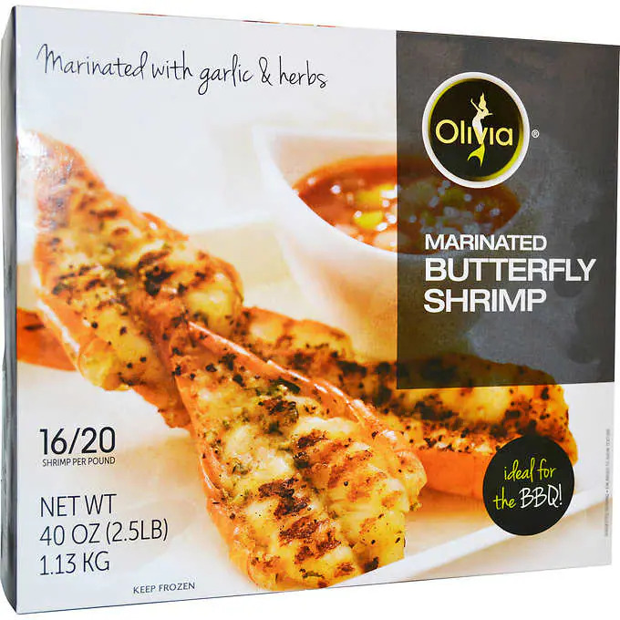
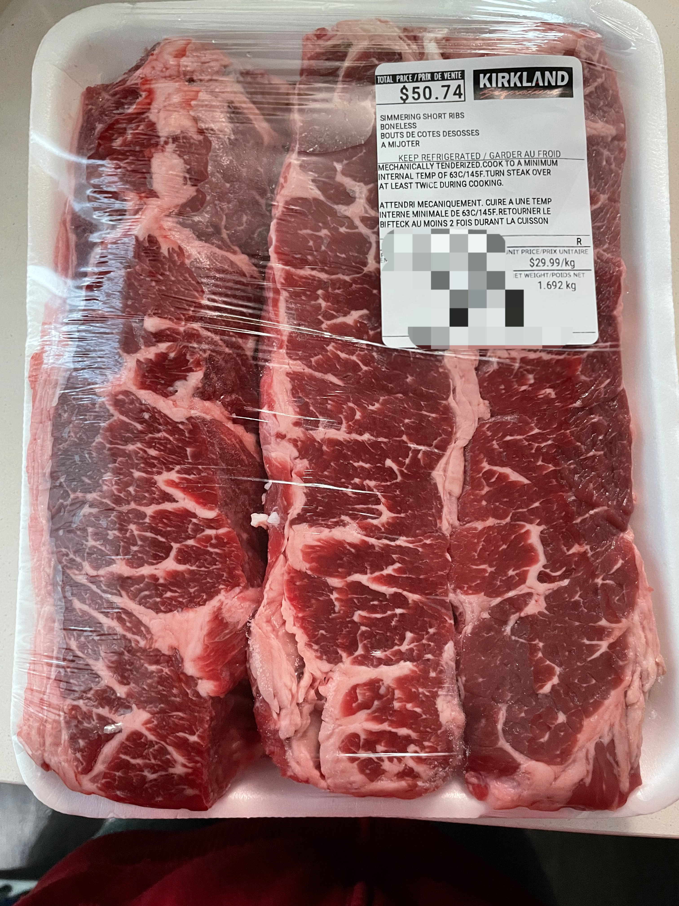

## 最近的买买买

### 什么值得买

#### 牛腩替代Boneless Cross Rib Pot Roast

做中式牛腩的绝佳替代品！我一直分不清各种牛肉部位，查了牛腩对应的英文是brisket，但本地超市都找不到，据说是因为中西式切割方法不同。后来看到北美博主的菜谱用了short ribs，最近终于有机会尝试一下，结果十分成功，软儒Q弹堪比专业餐馆的程度。

之前要买牛腩只能去中超买，选择十分有限。我还尝试过那种切好的stew beef，肉质非常柴，一点都不适合长时间慢炖。Short ribs的脂肪都很均匀，怎么炖都好吃。我挑的这块牛肉如名字所示，是不带骨的，我看到博主用过带骨的小块short ribs，看上去也很香～ 另外还有一种韩式烧烤的那种片状牛肉，虽然也叫short ribs但肉太薄了，感觉只适合烧烤不适合慢炖。

这是用牛肉和炖的牛肉汤做的卤蛋牛肉面：

### Costco腌制蝴蝶虾

优点：好吃，方便，一盒刚好两个人的量。

缺点：贵

### Costco short ribs

无比万能，

### 刨冰机