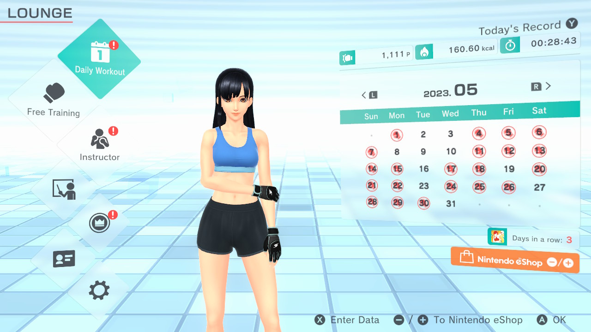
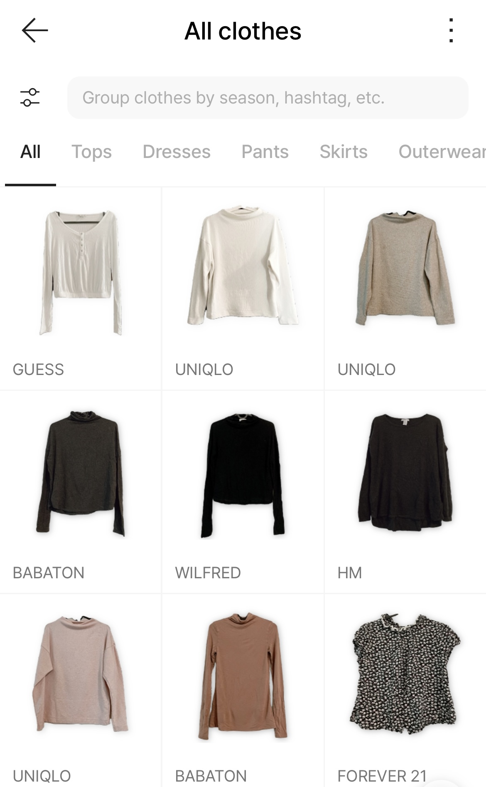
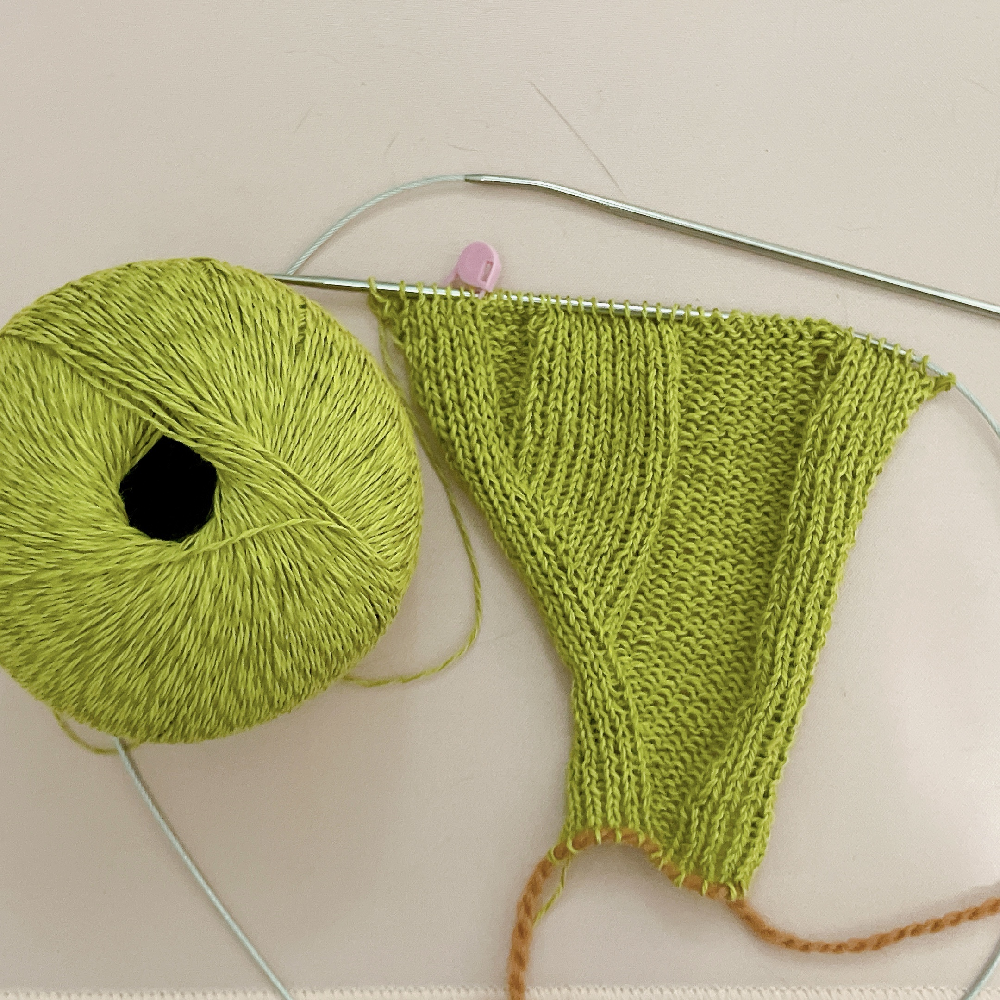

## 本月庆祝

**《Fitness Boxing 2》第一个月打卡完成**。[上个月买了二手Switch卡带]()，到现在差不多刚好一个月。中文翻译叫"有氧拳击"，但其实名字有些误导，因为拳击算是混合类运动。打拳真的很棒很解压，难得遇到一项能跟我擦出火花的运动，顿时觉得坚持锻炼也容易了许多。我的主要目标是提升心肺能力（苹果的健康app显示我的VO2 max值低于正常水平），减脂（肚子）倒是次要目标。平均一周五次，每次30分钟，体重倒是一斤没降，但腰腹部的线条肉眼可见地明显了。

**换下雪胎啦**。加拿大一年两次换胎：冬天换雪胎，冬天过完后换成四季胎。其实也不是强制要换，但雪胎在冬天的确好开很多，而且车险会便宜一些。依旧是家属完成了绝大部（quan）份（bu）的工作，但出现了一些意外：换胎时被告知要换的四季胎已经磨损太严重、需要更换了，于是本月临时多出一笔$1000的轮胎费用。

卸下雪胎后，才真正感觉冬天结束了。

## 新的尝试

### 电子衣橱

试着整理了一下衣橱，并拍照记录在Acloset这个app里面。目前整理了约三分之一，预计衣服鞋子总数大概在150件左右（不包括lo裙）。在整理中也挑出了不少打算捐掉的衣物，也算是个清理过程。

衣橱app最大的作用是帮我意识到某类衣物过剩，以及清理过多的替代品。清衣柜时最难对付的就是那些"不上不下"的衣服：还算喜欢，也能想出配套的搭配，但不知为何平时穿得很少。通常这种情况是由于衣橱里还同时存在优于它的替代品，即在相同情景下，我大概率会选择穿那件最优的替代品，而不是这件不上不下的衣服。

Acloset作为一个衣橱app相当不错，照片上传之后支持智能去除背景，挺省事的，UI也直观。价格完全免费，至于为什么免费嘛......当然是因为我们的衣橱数据就是它的产品呀！

## 玩了什么

### 上古卷轴5：天际

没错，在全球都在沉迷《塞尔达：王国之泪》的五月，我兴致勃勃地打开了十年前的这款游戏。

倒也不是不喜欢塞尔达。《旷野之息》头一次让我理解到什么是游戏性的极致，甚至可以让我无视极弱的故事情节。但我骨子里是个剧情党，最吸引我的是游戏里的"烟火气"：我沉浸于破落小村和大城镇的反差，享受无意中发现NPC秘密时的惊喜，对于不能两全的任务选择更加无法自拔。所以上古卷轴对我来说依旧是开放世界的天花板。

让我惊喜的是，PS5上的天际居然也支持mod了。虽然我以前在PC上只玩了原版，对各种捏人mod也没什么兴趣，但现在有不少游戏性和画面的加强mod，有选择总是好的。十年后重开新档+mod，几乎可以当个新游戏玩了。

至于为什么在现实中大门不出、二门不迈的我，会喜欢在RPG里寻找"人气"......这是个谜。

### Overcooked 2 DLC

[四月已经通关了本体]()，这个月开始玩*Carnival of Chaos*以及*Surf 'n' Turf*这两个DLC。前者的难度还可以接受，属于有挑战但不会感觉挫败。我和家属大概每关复盘个两三局就能三星通过；后者明显难度更高，找不到解决思路的时候还挺恼火的。

另外提一下版本区别：

- *Overcooked 2* : 2代本体
- *Overcooked 2 Gourmet Edition*：包含了2代本体+DLC，可与上面的2代同平台联机。
- *Overcooked: All You Can Eat*：1代+2代本体+全部DLC。本质上是1、2代的重制，跟以前版本并不兼容所以无法与上面的版本联机。优点是内容全包，且支持跨平台联机。

虽说游戏和电子产品一样买新不买旧，但我已经有1代且当时Gourmet Edition打折价格更加诱人，所以最终还是入手了Gourmet Edition。

## 看了什么

### 超级马里奥大电影

马里奥系列我玩得不多，算是个路人粉丝。近年来的Switch作品玩了几个，发现这依旧是个硬核横版过关游戏，也因此游戏时间都不长。凑热闹去看了这部，发现里面居然塞了不少只有玩家才知道的设定彩蛋，核心粉丝肯定能发现更多。看近几年的趋势，似乎厂商终于发现了老玩家的消费能力，愿意花时间在改编作品里打磨各种细节了，为粉丝们感到开心。

## 织毛线 Knitting

买了几卷亚麻和棉的毛线，准备用来织一两件夏天的衣服。图样是最纠结的，每次要想很久才能决定织哪个。在五月的最后几天终于看中了一个小背心的图案，目前进度还不错，希望能在夏天结束前织完穿上。

## 暂时搁置

**罪案类Podcast**。本月没怎么动毛线，因此失去了听播客的场景。前几个月听了不少，根据notion的记录已经有100+小时了。还好年初时设置播客挑战时只设了50个案件，虽然夏天进度缓慢，但看上去依旧是个能达到的目标。

****

> Photo by <a href="https://unsplash.com/@yoksel?utm_source=unsplash&utm_medium=referral&utm_content=creditCopyText">Yoksel 🌿 Zok</a> on <a href="https://unsplash.com/photos/gQWRTLLeJvQ?utm_source=unsplash&utm_medium=referral&utm_content=creditCopyText">Unsplash</a>
