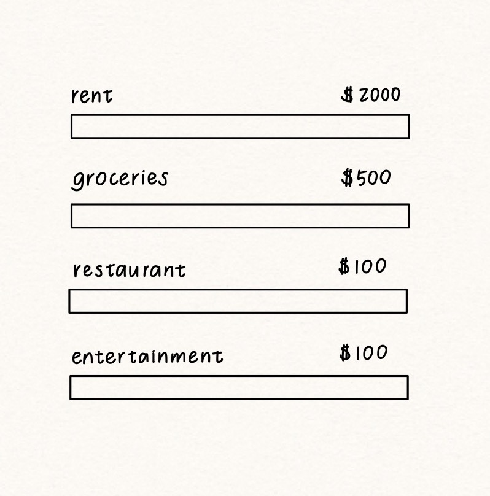
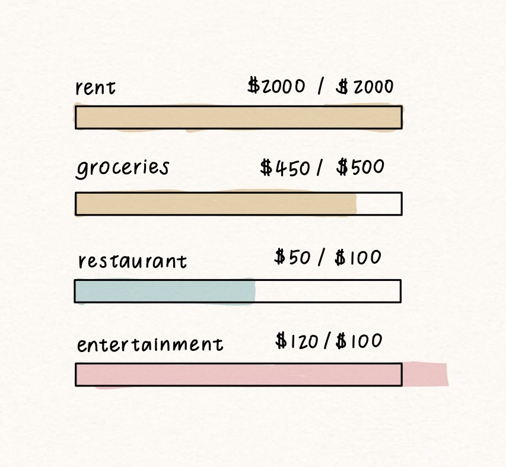
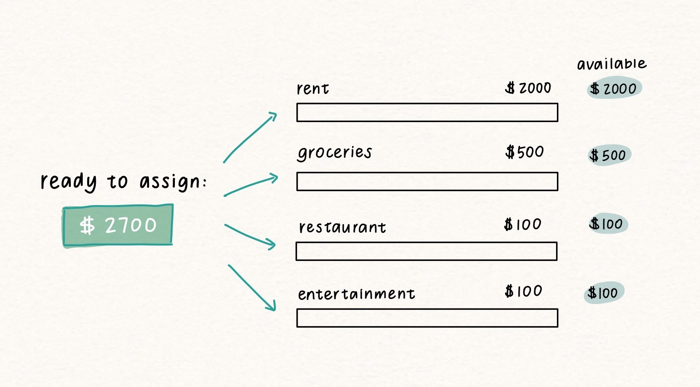
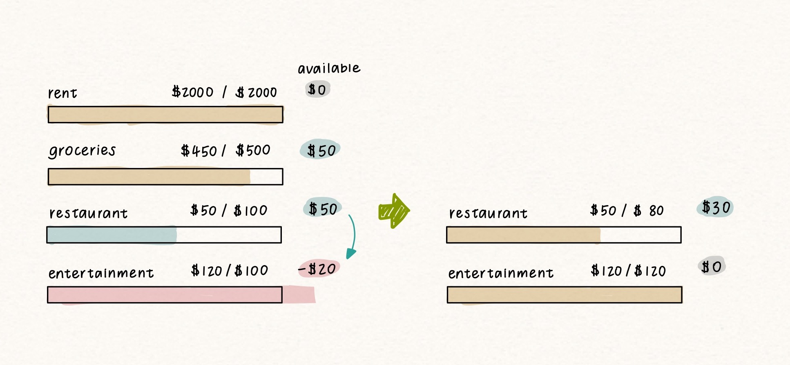
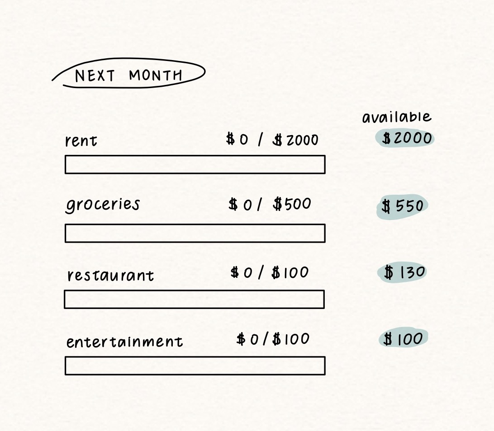

> [YNAB](http://ynab.com)全名为You Need A Budget，是一款全平台的记账软件。本文主要讨论YNAB的理念、它能带来的实际价值以及跟其他记账软件的区别。具体使用教程见文末推荐。

## 为什么要记账

先说结果。我家从三年前开始使用YNAB记账，从一堆算不清的糊涂账，到现在两人对各个家庭预算和支出都了如指掌。期间家庭净资产翻了五倍（我的工资可没涨这么多），至于节省下的冲动消费，不说几万少说也上千刀了，完全对得起YNAB的~~保护费~~年费。在去年疯狂通胀近10%的情况下，依旧能做到跟前年储蓄率持平，YNAB功不可没。

记账的目的，总结起来也就两大类：

- 记录和汇总明细，从而了解钱的去向和总体财务情况
- 提高财务管理意识，控制消费

如果你只需要上述第一点需求，那么绝大部分软件都能做到。YNAB核心竞争力在于第二点，即规划、掌控，而不像普通软件在于记录和生成漂亮的图表。原因在于：光知道自己钱花在哪里了，是无法让你控制自己少消费的！至少影响力相当有限。

使用好YNAB这个工具，不光能有效控制自己的消费，还能带来强大的财务掌控感。

## 普通预算法 vs YNAB预算法

在用YNAB之前，我的记账方法和大多数人是一样的：纯“记录”的流水账，即统计每个月的支出，看都花在哪里了。后来也会做预算，在月初定下每项支出的额度，Mint等大多数记账软件的逻辑也是如此。画个图来看，大概是这样的：

  

计划很美好，但往往结果是：看报表的时候发现某项超支，但这个事情**已经**发生了，给人感觉非常挫败（"怎么这个月又超支了？哎呀没办法下个月少花点吧"），且有一种无法控制自己花销的感觉。

YNAB是什么样的呢？它做预算之前有一个前提：**首先你得有钱花**。这个让YNAB和其他软件有了本质的区别。如果进账为零，YNAB是不允许做预算的。比如上个月月光了，即使我们知道过两天就会发工资，但在这笔钱到手之前，YNAB不让做预算，直到这笔钱真正进帐了，我们才能把这笔钱分配给每一项，且我们的预算不能超出这笔工资。这个原则在YNAB官网被称为"Give every dollar a job（让每一块钱都各司其职）"。

看上去好像差不多，但为什么这两种预算在结果上会有区别呢？打个比方，同样是为了减少卡路里摄入，普通的预算方式相当于我们给自己制定了一周的健康食谱，但还没购买食材；YNAB预算法则像是meal prep，食材已经买好（收入），并根据食谱分装在各个小盒里（预算），做菜时拿出来即可（消费）。普通预算法的计划（食谱）是虚空的，因为做预算的钱不是已到手的收入，所以即使你花超支了（吃太多），是可以随意提高预算余额（食谱怎么写都行反正又不用跟食材一一对上）而无需付出任何代价的！也就是说它没有一个take action的机制来反制我们超支的行为！而YNAB做预算用的是真正到手的东西，结果就是，**只有YNAB的预算余额才是我们实实在在的钱**。至于哪种更容易达到健康饮食的目标，不言自明吧。

> 没有实际用过的话可能还是很难理解这一点。但只要记住：YNAB的余额代表你实际上真的有这么多钱就够了。

## YNAB的精髓及核心：预算

我们现在知道了YNAB的预算余额代表的是真正的钱，那么下一个问题就是分配。在各项都未超支的情况下可能看不出来区别，但在消费超支时就显现出了这个特点的优势：我们需要考虑钱的分配优先级了。

假如月末时发现“娱乐”项目超支$20了，那怎么办？YNAB预算余额是不能为负的（好比你没法在信封里装负数的现金）。这时我们需要做的是调整预算，花超支的钱要从其他地方匀出来。

在上面这个例子里，“外食”和“食品”都还有余额的情况下，我们选择从“外食”这一项挪了$20给超支的“娱乐”。这样一来，我们这个月“外食”的预算就少了，本来可以吃两顿，现在可能只能吃一顿。换句话说，我们需要为自己的超支行为买单（take action）。这个预算方式帮助我们思考花钱的优先级：鱼和熊掌不可得兼，在消费超支的时候，你愿意选择优先削减哪一项？假如哪项都不愿意妥协，是不是在行为上就更有动力控制自己不去消费了？

这是YNAB最强大之处：**它能够通过预算来影响我们的消费行为**。

由于我们需要为超支行为付出代价（trade-off），这个机制对那些“可有可无”的消费影响巨大。比如我有个游戏很想买，但看一下YNAB发现一旦买了“娱乐”就会超支，而同时这个月还要给“外食”留出钱跟朋友吃大餐，那么我很可能就忍忍等下个月再说了。所以很多YNAB教程都会提到它是looking forward（看向未来），而不像一般软件是looking backwards（检查过去）。

## 为未来准备专项资金

由于YNAB的余额是实际的钱（重复三遍），所以余额自然也能够累积，这点让我们建立专项资金变得很容易。像保险、旅游、家电这种以年为单位的大件支出，一般做法是单独分一个帐户出来，每个月存钱在里面。但在YNAB里面不需要这么干，我们只需要为其建立专项预算，等发钱后分配给这项预算即可。**钱放在具体哪个帐户不重要，重要的是它已经有了任务、被分配给了专项资金**。我家两个人一共有五六个chequing account、十几张信用卡，从来没有抓瞎过，全靠YNAB管理。已经养成了不看银行账户余额的习惯，要看旅游资金够不够，只需看YNAB对应“旅游”预算就知道攒没攒够、不够的话大概还需要攒多久。

在上面提到的例子里，“食品”和“外食”的预算分别剩下$50和$30，那在月初预算不变的情况下，上个月花剩下的这些会自动累计到本月预算里。

换成旅游这种年度支出也是一个道理，假如每个月都累积$100，一年之后就是$1200。这能帮助我们建立未雨绸缪的用钱习惯，而且也有足够影响力来控制冲动消费。假设本月我们“娱乐”又即将超支，你真的确定要从“旅游”里削减预算给当前消费吗？当购物欲望上头的时候，**YNAB的预算系统让我们“看”到冲动消费对未来的影响，鼓励我们向自己提问来做出更加理性的消费决策，从而做到不那么短视，真正掌控自己的花销，而不是被花销掌控**。

## 开始学习用YNAB吧！

百闻不如一见，开始试用YNAB吧！YNAB提供34天的免费试用，之后是$99/年或者$14.99/月。YNAB的费用和学习曲线的确高，但如开头所言，它带来的价值远远超出了这些成本。除了[官网的文字教程](https://www.ynab.com/search/getting+started/)和[免费workshop](https://www.ynab.com/free-workshops/#category-getting-started)，我推荐[Youtube博主Nick True的教程系列](https://youtube.com/playlist?list=PLHokQCjONqvY6Jk38CV5avo4Di94SMwK8)，手把手教你设定自己的预算。再推荐一个网页浏览器插件[YNAB Toolkit](https://www.toolkitforynab.com/)，能帮助生成更详细的图表。即使不愿意长期订阅，我也推荐尝试至少半年到一年，就当作理财的学费。等彻底理解这套理念之后，再用别的工具建立类似的系统。

有被这篇安利到的话，可以使用我的推荐码链接(referral)。如果最终决定订阅，我们都会得到免费一个月的使用额度。  
https://ynab.com/referral/?ref=jGfCI1EqHRIIuM2D

更新：[有象友提醒YNAB还有一年的学生优惠](https://mastodon.social/@akane09/110547880340700060)！根据[官网的说明](https://www.ynab.com/college/)，在美学生填表验证即可，非美国学校或者已有账号的可以联系客服。

祝大家早日财务自由！

## 更新：YNAB的市场替代品/竞品比较

有友友提到了某些地区YNAB不支持银行自动导入明细，就顺便看了一圈市场上的替代品。结论先放在前头：截止至目前，还没有同等的产品可以替代YNAB。但如果YNAB不支持同步你的所在地银行（印象里YNAB只支持欧洲和北美银行），可以考虑试试下面提到的选项。如果所在地是欧美，YNAB依旧是最佳选择，毕竟有银行自动同步还是很香的～

YNAB实质上是个Zero-based budgeting/[信封记账法](https://tw.stock.yahoo.com/news/信封袋記帳法-3步驟就上手-060041421.html)系统，可能是由于这样设计较为复杂，市面上用这套系统的记账软件非常少，比较有名的软件如Mint和MoneyWiz全是Forecast-based，也即本文提到的普通预算法的逻辑。目前我知道的跟YNAB系统相同的只有以下几个软件：

> 注：我没有在实际理财中使用过以下app，从各种评测来看相比YNAB都多少缺一些细节上的特性（feature），此外它们的资源教程都没有YNAB丰富。我只能确定他们跟YNAB理念大致相同，评价仅供参考。

[Actual Budget](https://actualbudget.com)

- 优点：开源，免费；目前Github上开发还比较活跃  
- 缺点：需自建（self-hosting），要求一定技术基础且对数据风险自负；不支持连接银行同步；没有移动端App所以无法随时查看预算；靠爱发电也会带来一些不确定性

结论：门槛较高，坐标非欧美地区+会自建服务且能接受没有移动App的可以一试

[Buckets](https://www.budgetwithbuckets.com)

- 优点：一次性付费$49（虽然马上要涨了）；提供免费版试用（据说可以无限续）；有移动端App  
- 缺点：也不支持银行同步，但提供第三方付费同步和Macro导入的选项

结论：坐标非欧美的可以试试

[Goodbudget](https://goodbudget.com)

- 优点：提供免费版选择；有移动端App  
- 缺点：不支持银行同步，所以付费账户的价格毫无竞争力（一年$70还不如去用YNAB）

结论：不建议购买付费服务，但对非欧美地区+只有一个账户的人可以尝试免费版

[YNAB Google Sheet模板](https://bloomingfinances.wordpress.com/2022/01/05/free-ynab-spreadsheet-instructions/)

- 优点：免费  
- 缺点：UI不直观；没有移动端App

结论：只建议已经非常熟悉YNAB且能接受全程手操的用户尝试。非常不建议新手使用，不然可能会非常迷惑且get不到它的好处

还有两个看上去像是替代，但其实并不属于同一套系统的：

- MoneyWiz：前面提到过它是Forecast-based，其实它的[官方文档](https://help.wiz.money/en/articles/4838574-setup-envelope-budgeting-system)有提供建立信封预算法的选项。之所以没有列在上面，是因为我认为它软件设计的逻辑就不是给信封预算法用的。除了这个官方文档，相关教程资源也很少。这套系统少了引导会很容易在使用过程中被带偏，结果还是回到普通预算法的模式里。

- EveryDollar：是个半吊子的信封预算法，因为它允许用户提前为本月还没到手的工资做预算。对于不月光且工资稳定的人来说可能没什么差别，但我认为这种设计并不利于用户建立良好的信封预算理财观。另外，鉴于创始人黑料实在太多且人品堪忧（例如炒掉怀孕女雇员就因为她没遵守“公司信仰”发生了婚前性行为），在此就不放链接引流了
