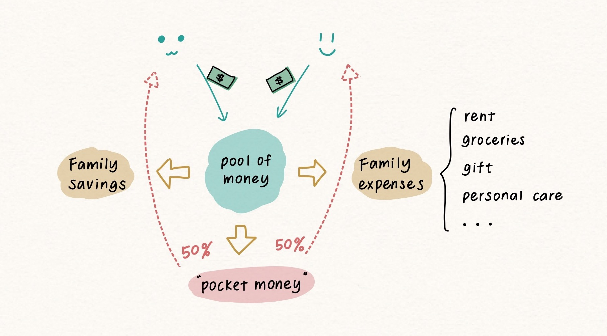

> 本文的“伴侣”主要指婚后或Common-law。  
> 婚姻本质上是经济契约，没有签这份契约的话就也不会产生法律上的共同财产，所以对于非法律绑定的伴侣可能本文提到的情况并不适用，请自行斟酌参考。

## 伴侣间的分摊模式

大概总结一下，伴侣间有以下几种分摊模式：

**共享类**：钱放在一起花，不分你我。根据财权不同还可以细分为两类：

- 一方上交工资，所有家庭收入都由另一方全权管理的**传统型**
- 所有工资存入共同账户，双方共同管理的**合资型**

**AA类**：有很多变种，且每种方式的具体执行方式因人而异。

- 所有共同支出全部严格对半的**绝对AA**。有种方式是各自把收入的一半放在共同账户用于支出，本质也属于这类
- 按收入比例分摊支出的**比例型AA**。通常是先确定一个大致的所需资金总额，再按自己收入占家庭总收入的比例存入共同账户
- “你付这次我付下次”有来有往的**懒人AA**
- 按费用明细分配“你付房租我付水电网”的**明细AA**

以上模式各有千秋。重点是，无论你选择哪种模式，都需要面对一个问题：

## 什么是真正的家庭开销？

有人可能说，这还不简单？不就是房租水电，再加日常吃喝玩乐的钱。

但是很多支出虽然不是双方分享，却是双方都需要花费的，例如看病、剪头发。当然，每个人每年是否生病是不固定的，那如果有一方看病次数较多，那从个人资金里出这一部分钱，是否是对ta不公平呢？毕竟，这些都算是必需支出。

这就是我的家庭预算原则第一条：**双方都可能用到的必需性支出均算作家庭开销，无论对方是否共享**。

此外，异性伴侣间还经常会有另一个问题：即使双方的收入一样也绝对AA，但女生往往由于要定期添置护肤品、化妆品而存不下多少钱。除了像卫生棉这样显而易见的女性必需品，还有很多支出其实是带性别化的（对女性而言俗称“粉红税”）。即使有些支出看上去并不那么“必要”（如化妆品），但由于社会期望的存在，很多时候我们并无法把这些花费完全精简掉。这就是标题说的性别因素。

所以第二条预算原则是：**将个人开销去性别化，并入家庭开销**。

这两条其实最终要达到的是同一个目的：**尽量消除对个人的支出歧视**。

## 去性别化的家庭开销分类

可能上面说得比较抽象，下面将以我家具体预算类别为例，说明什么是我认为的真正的家庭开销。

我的家庭预算是这么分类的（需要强调的类别将以粗体标记）：

- 以月为单位的固定支出
  - 房租
  - 水电和话费账单
  
这一项无论在哪种模式下基本不会出现什么争议。重点是以下类别：

- 以月为单位的浮动支出
  - 食品采购
  - 外食
  - 猫咪日常花销
  - 药品保健
  - **个人护理**
  - 其他额外开销

其中“个人护理”不仅包括两人都需要用到的沐浴露等日化用品，还包括了我的护肤及化妆品。我的护肤化妆流程都很简单所以需要购买的也不算太多。如果是有美妆的爱好，我会先分清多少是正常范围内的美妆花销，又有多少是由于对美妆的兴趣而额外产生的兴趣型花销，详情见下文[零花钱制度](#个人零花钱制度)。

- 以季度或年为单位的支出
  - 汽车保险
  - Costco年费
  - **礼物**

你没看错，礼物费用也记在家庭开销里，这符合第一条原则“都可能用到的必需性支出”。这也很方便地将礼物的预算圈在一个大致范围，避免出现双方送礼价值过于不对等的情况。*P.S.我家其实有一个礼物心愿单，每年各自往里面添加心愿，对方从里面挑选购买即可。这样大家都不用为买礼物而操心，既避免了惊吓又能保留一定的惊喜感。*

- 可预计的非常规支出
  - 旅行
  - **大件购买**，如PS5、家电升级
  - 猫咪医疗金

像PS5这样的大件购买也被划成家庭开销，因为我们两个人都会享受到。但游戏盘则要根据情况看是否归入家庭花销，具体[见下文](#个人零花钱制度)。

- 用于意料外的紧急预备金，应付各种：
  - 天灾我亏（车撞栏杆啦啊啊啊😱）
  - 我花式亏（考试fail了要重考😭）
  - 被骗我亏（谢天谢地暂时还没遇到）

- 家庭储备金，这是为长期准备的储蓄，一般情况下不会动用

以上所说的全部算是家庭预算。那么个人的消费，比如各种为兴趣爱好花的钱怎么办呢？这就引入了“零花钱制度”。

## 个人零花钱制度

零花钱制度，如字面所言就是专门分配一笔钱给双方，用于各自的私人消费。之所以上面的家庭预算要那么划分，是因为**去掉个人必需+性别化支出之后剩下的，才是反映你真实私人消费的金额**。

至于要怎么执行，根据分配模式的不同具体方法也不一样。我家的分摊模式，之前在[《记账软件YNAB：为什么它是最强的记账app》]()里提到过，以前都是糊涂账，因为当时用的是懒人型AA，用YNAB记账之后则改成了共享类别里的合资型。共享型理财的一大缺点是容易为个人支出扯皮，但通过记账来合理规划预算则能很好地解决这个问题。

具体而言，我家的零花钱分配大概是这样运行的：

1. 拿到工资后，双方存入共同账户。这样我们就有了一个资金池
2. 用YNAB为这笔钱制定预算，包括家庭消费、家庭储蓄和个人零花钱（我家是每人每月$100）。这一步不需要转账
3. 家庭消费的时候，从最优的那张信用卡付款（比如在超市就用食品返现高的卡）。只要YNAB这项的额度足够，基本不需双方讨论。比如我的护肤品支出，知会对方即可
4. 当个人消费时，根据在YNAB的零花钱余额自行决定购买与否，另一方没有决策权。依旧选择最优信用卡付款
5. 快到信用卡还款日时，用共同账户给以上所有消费还款

这其中零花钱也可以做细分。以我的零花钱分类为例，分了以下几种：

- 零食钱：各种小甜酒（家属不喝酒）
- 各种兴趣：无法以具体项目命名，因为我兴趣实在太·多·了。心血来潮想购买的各种东西也归为这项
- 游戏：只有我玩、对方不玩的电子游戏
- 我的小金库：用于较昂贵的物品购买。一次性消费金额超过$200的通常都从这项扣除，例如一整套机械键盘

例如我想买钢笔墨水的时候，先看YNAB的零花钱单项余额够不够，余额充足就直接买。如果余额吃紧，看能不能把“游戏”的部分余额挪到这项（但这样游戏的预算就变少了），或者选择不买。

我把小金库单独立项，目的是把平时的支出跟真正想存钱买的物品区别开来。有时忽然对某个东西上头，价格也不算贵，但每个月加下来其实不少。如果把小金库跟平时支出全部混在一起，可能就会在平时消费时给自己一种“我还有很多钱可以用”的错觉，导致最后真正想买的东西买不起。

上文还提到了游戏盘需要具体分析，因为我们俩喜欢的游戏类型不一样，很多我玩的游戏对方并不喜欢，这个时候消费就应归入我的零花钱。但如果是两个人都会玩的游戏比如双人成行、或者对方突然对我的游戏感兴趣了，这时就会归入家庭开销。

此外，还有一种折中方式是将部分归入个人零花钱、部分归入家庭支出。例如我家属的婚礼西服，不能完全归入家庭预算（已经有很多套西装了，另买一套只是为了更好看合身），但完全由零花钱支出也不太公平。最后选择按4:6的比例分别归入家庭和个人零花钱，选择40%家庭预算是因为这个数额大致match我的婚纱费用。

所以，**究竟是归为零花钱消费亦或是家庭消费，取决于双方是否都享受到了这项消费带来的价值**。有时候可能会出现争议，这个时候就需要双方进行讨论，看能不能说（xi）服（nao）另一方把这一项算作家庭消费了。

> - ❌ ~~错误示范：“我要买的最新Apple Watch因为xx功能可以提升我的效率所以也能给家里带来收益啊”~~
> - ✅ 正确示范：“我织的毛线毯子是给猫咪用的，四舍五入家庭也享用了！所以家庭应该支付我的毛线费(^-^)～”

## 写在最后

每个家庭由于分摊方式不同，执行方式也会不一样。比如绝对AA的伴侣就没有零花钱制度，但可以重新考虑一下个人支出，将歧视性的支出也放在家庭开销内。

尽量消除对个人的支出歧视，才是相对的公平（Equity），而不是一味要求绝对平等（Equality）。

名图镇楼：

